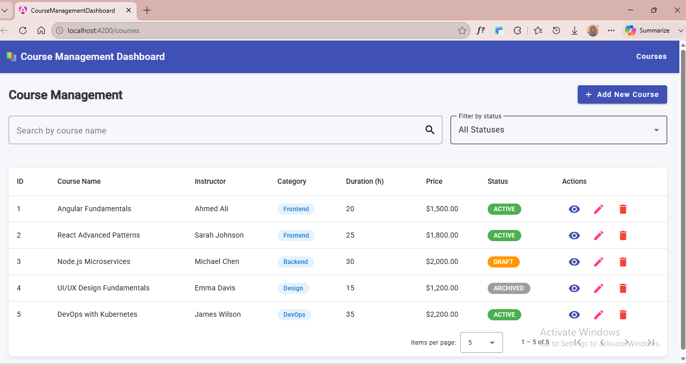
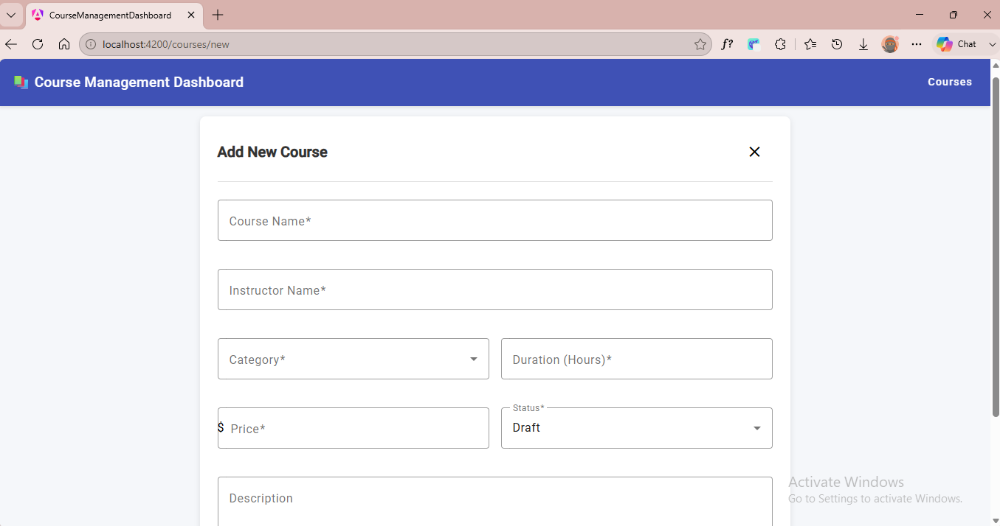
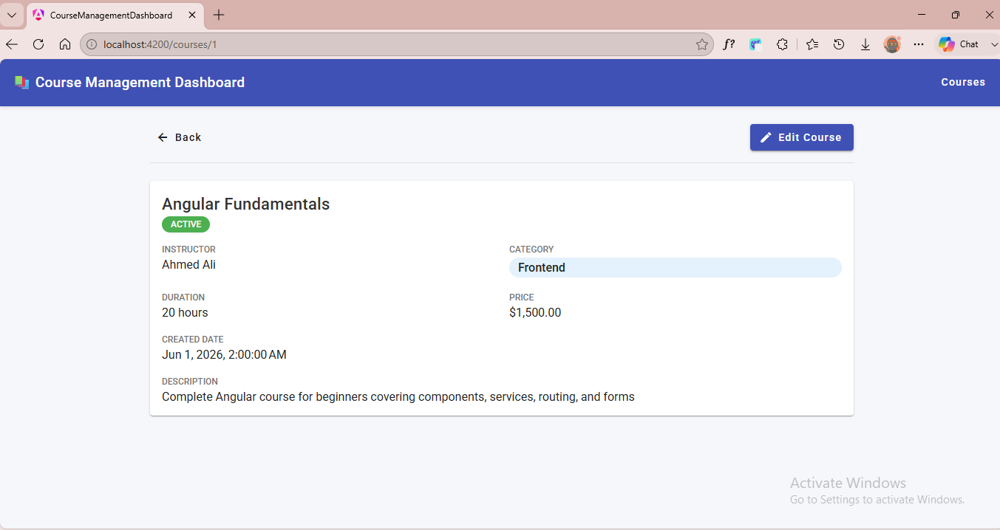
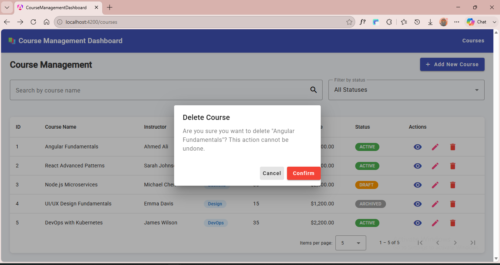

# 📚 Course Management Dashboard

A responsive Angular web application for managing online courses, built with Angular 22 and Angular Material.

---

## 🛠 Technologies Used

- **Angular 22** — standalone components architecture
- **Angular Material** — UI component library
- **TypeScript** — strongly typed language
- **RxJS** — reactive programming for HTTP and state management
- **JSON Server** — mock REST API
- **SCSS** — component styling

---

## ✅ Features Implemented

- **Course List** — paginated table with sorting, search by name, and filter by status
- **Add Course** — reactive form with full validation
- **Edit Course** — pre-filled form with existing course data
- **Course Details** — full course info view
- **Delete Course** — confirmation modal before deletion
- **Notifications** — success/error snackbar messages
- **Loading States** — spinner during data fetch
- **Responsive Design** — works on desktop and mobile

---

## 📸 Screenshots

### Course List



### Add Course



### Course Details



### Delete Confirmation



---

## 🚀 How to Run the Project

### 1. Clone the repository

```bash
git clone <your-repo-url>
cd course-management-dashboard
```

### 2. Install dependencies

```bash
npm install
```

### 3. Start the Mock API (JSON Server) — in a separate terminal

```bash
npm run mock-api
```

> This starts JSON Server on `http://localhost:3000`

### 4. Start the Angular app — in another terminal

```bash
ng serve
```

> Open your browser at `http://localhost:4200`

> ⚠️ Both terminals must be running at the same time.

---

## 🗄 Mock API Explanation

This project uses **JSON Server** as a mock REST API to simulate a backend.

- The data file is located at `src/db.json`
- JSON Server watches this file and exposes a full REST API automatically

### Available endpoints:

| Method | Endpoint       | Description       |
| ------ | -------------- | ----------------- |
| GET    | `/courses`     | Get all courses   |
| GET    | `/courses/:id` | Get course by ID  |
| POST   | `/courses`     | Create new course |
| PUT    | `/courses/:id` | Update course     |
| DELETE | `/courses/:id` | Delete course     |

### Sample data includes 5 pre-loaded courses:

- Angular Fundamentals
- React Advanced Patterns
- Node.js Microservices
- UI/UX Design Fundamentals
- DevOps with Kubernetes

---

## ⚙️ Add mock-api script to package.json

Make sure your `package.json` has this script:

```json
"scripts": {
  "mock-api": "json-server src/db.json --port 3000"
}
```

---

## 📁 Project Structure

```
src/
├── app/
│   ├── core/
│   │   └── services/
│   │       ├── loading.service.ts
│   │       └── notification.service.ts
│   ├── features/
│   │   └── courses/
│   │       ├── constants/
│   │       ├── models/
│   │       ├── pages/
│   │       │   ├── course-list/
│   │       │   ├── course-form/
│   │       │   └── course-details/
│   │       ├── services/
│   │       └── courses.routes.ts
│   ├── shared/
│   │   └── components/
│   │       ├── confirmation-modal/
│   │       └── loading-spinner/
│   ├── app.component.ts
│   ├── app.config.ts
│   └── app.routes.ts
├── environments/
│   └── environment.ts
└── db.json
```

---

## 💡 Assumptions

- Course IDs are auto-incremented numeric strings (e.g. "1", "2", "3")
- `createdDate` is automatically set to the current date/time when a course is created
- Status defaults to "Draft" when creating a new course
- Description is optional (max 500 characters)
- Duration must be at least 1 hour
- Price must be 0 or greater

---

## 🎁 Bonus Features

- **Search + Filter combined** — search by name and filter by status simultaneously
- **Confirmation modal** — prevents accidental deletion
- **Form validation** — real-time error messages with min/max rules
- **Reactive state management** — `BehaviorSubject` caches courses and syncs across components
- **Standalone Angular architecture** — uses modern Angular 17+ standalone components with no NgModules

## 🌐 Live Demo

https://course-management-dashboard-mauve.vercel.app/courses

> **Note:** The live demo is for UI preview only.
> To see full functionality with data, please run the project locally
> following the instructions above.
